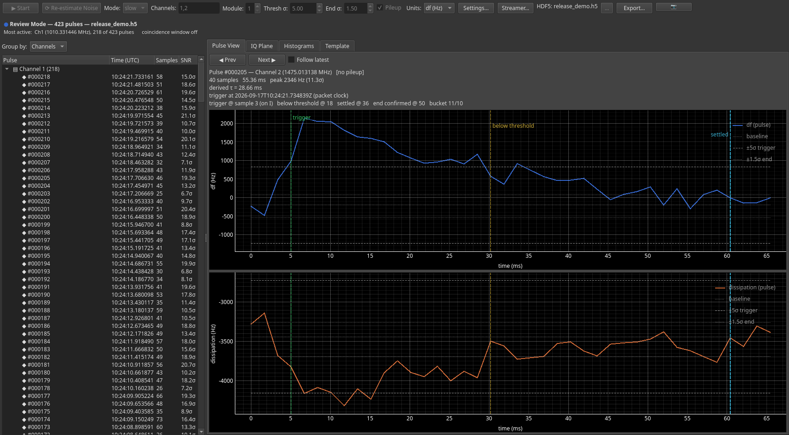
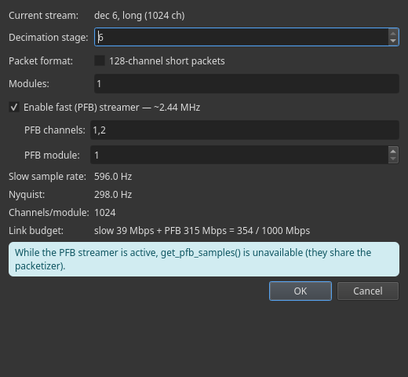
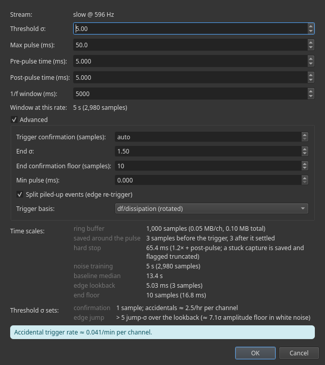
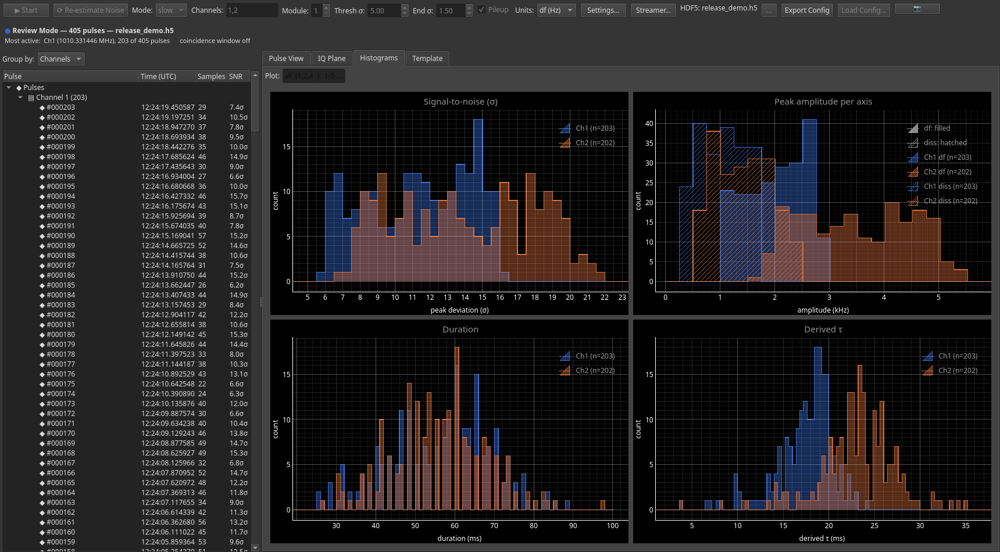

# Pulse Capture

rfmux can trigger on transient events in a detector timestream as the board
streams, record each pulse to HDF5 with its summary statistics, and show
them as they arrive. It runs in Periscope, from a script, and against the
simulated board in mock-mode.

This guide shows what the feature does and how to drive it from Periscope.
For the headless version, with every step as a runnable cell, open the
[Pulse Capture notebook](../../rfmux/reference-notebooks/Demos/pulse_capture.md).

## Pulses, not timestreams


A capture estimates the noise on each channel first, then triggers when a
sample leaves `threshold_sigma` faster than the baseline 1/f drift.
It closes when both axes are back inside `end_sigma` of the baseline.
The saved window starts before the trigger, so the rising edge is kept, and ends
where the pulse settled; the confirmation that follows only verifies that
it stayed there. A capture still open at 1.2 times `max_pulse_ms` is
closed there and flagged `truncated`. Two pulses that
overlap are split when the signal rises sharply again on the tail of the
first, and both fragments are flagged `pileup`. The figure above is pulled
from the output from a mock-mode run. All of the annotated metadata for the pulse
also exist within the HDF5.

Each pulse also carries its signal-to-noise, peak amplitude, duration, derived
decay constant and trigger time in UTC, decoded from the packet timestamps.
The file is written as the capture runs, so an interrupted run keeps what it
saw.

## Capture in Periscope



1. Start Periscope on a board or the simulator:

   ```bash
   periscope 0042        # a board, by serial
   periscope MOCK        # the simulated board
   ```

2. Press **Pulse Capture** in the main toolbar. The panel docks in the
   window.
3. Set **Mode** (slow, fast or both), **Channels** (`1,2`, `2-19`, or `all`
   for every biased channel) and **Module**.
4. Set **Thresh σ** and **End σ**. **Settings…** holds the rest; see
   [Configuring the pulse capture engine](#configuring-the-pulse-capture-engine).
5. For fast or both mode, press **Streamer…** and put the PFB streamer on
   the channels you will capture; see
   [Selecting the stream](#selecting-the-stream).
6. Choose the output file with **…**, then press **▶ Start**.

The left pane lists every pulse with its length, signal-to-noise and trigger
time. **Pulse View** stacks the two axes against a common time axis with
marks for the trigger, the drop below threshold and the settled point that
ends the record. Left and Right move through the pulses, Home and End jump
to the first and
last, Space cycles the tabs, and Ctrl+E exports the list. **⟳ Re-estimate
Noise** retrains the baseline without stopping.

**Units** switches the pulse view, histograms and templates between counts,
volts and df in hertz. Hertz needs a calibrated channel (below). In both
mode the pair view shows each stream in the units it was stored in.

## Selecting the stream



The capture reads whatever the board streams. **Mode** on the panel picks
the stream: `slow` for the readout stream, `fast` for the PFB stream, `both`
for a dual-stream capture (see
[Fast and dual-stream captures](#fast-and-dual-stream-captures)).
**Streamer…** opens the Streamer Configuration dialog, the same one the
main window uses. **OK** applies it to the board at once.

- **Current stream** is what the board streams now, read when the dialog
  opens.
- **Decimation stage** sets the slow sample rate (table below). Aim for ten
  or more samples across one decay constant of your pulses.
- **Packet format**: short packets carry 128 channels per module, long
  packets 1024. Below stage 3 only short packets fit the link, and the box
  is locked on.
- **Modules** lists the modules the slow stream carries, as `1,2` or `1-4`.
- **Enable fast (PFB) streamer** turns the 2.44 MHz stream on for up to
  four **PFB channels** of one **PFB module**. Unchecked, **OK** turns it
  off. While it runs, `get_pfb_samples` is unavailable.

| Stage | 0 | 1 | 2 | 3 | 4 | 5 | 6 |
| --- | --- | --- | --- | --- | --- | --- | --- |
| Slow sample rate | 38.1 kHz | 19.1 kHz | 9.5 kHz | 4.8 kHz | 2.4 kHz | 1.2 kHz | 596 Hz |

The rows below the settings report what they give: the slow sample rate and
its Nyquist frequency, the channels per module, and the link budget in Mbps
against the 1 GbE port. The banner lists anything wrong. An error disables
**OK**: long packets below stage 3, more than four PFB channels, or a
budget over 1000 Mbps. A warning, such as a budget over 800 Mbps, leaves it
enabled.

The capture never changes the streamer. A fast capture needs every
channel it captures among the PFB channels, on the module it captures; if
they do not match, the panel says so and stops. A both capture takes every
channel on the slow stream and fast data for the ones the PFB streamer
carries, so `all` over a hundred channels with four streamed works: the
status line names the four, the rest capture slow only, and their pulses
come out as slow-only pairs. If none of the captured channels is streamed,
the capture stops.

## Configuring the pulse capture engine



**Thresh σ** (5.0), **End σ** (1.5) and **Pileup** (on) sit on the panel's
toolbar. **Settings…** opens the Pulse Capture Settings dialog with the
rest. Both edit one configuration: **OK** applies the dialog and the
toolbar follows.

- **Stream** is the stream and sample rate the capture will read. The
  derived values below are computed for it.
- **Threshold σ** is how significant an event must be. Both trigger tests
  use it: a sample must leave the baseline by this many σ, and the signal
  must have risen by this many jump-σ within the edge lookback. The second
  test is a difference of raw samples, so baseline drift cannot fake it.
- **Max pulse (ms)** (250) is the longest pulse you expect. It sizes
  everything else: the ring buffer at 1.5 times it, the hard stop at 1.2,
  the edge lookback and the noise training. Estimate it generously. A pulse
  that outlasts the buffer loses its rising edge.
- **Noise training** is derived: 20 times the max pulse, the record the
  noise σ and the rolling baseline are estimated from.

**Advanced** opens the rest. The defaults suit most captures.

- **Trigger confirmation (samples)**: consecutive samples that must clear
  the threshold. `auto` picks the fewest that keep accidental triggers
  under one per minute per channel at this rate: 1 at 596 Hz, 2 on the PFB
  stream.
- **End σ**: a capture ends once both axes are back inside this band, of
  the baseline or of the level the pulse rose from. It must sit below
  **Threshold σ**.
- **End confirmation floor (samples)** (10): the fewest in-band samples
  that confirm the end. For long pulses the count grows to **Margin
  fraction** of the time above threshold. It counts down while the signal
  is out of band, so one noisy sample does not restart it. The saved
  window ends where the pulse settled; the confirmation only verifies it.
- **Margin fraction** (0.10): the fraction of the saved window kept before
  the trigger, the confirmation count as a fraction of the time above
  threshold, and the edge lookback as a fraction of the max pulse.
- **Min pulse (ms)** (0): pulses shorter than this are dropped as
  glitches. 0 turns the filter off.
- **Split piled-up events** (on): a fresh rise on the tail of a pulse
  starts a new one. The rise is judged against the larger of the trained
  noise and the scatter inside the capture, and must hold for as many
  samples as a trigger needs at this rate, so neither noise that grows
  with the pulse nor one stray sample splits it. Both fragments are
  flagged `pileup`. Templates skip them, histograms keep them.
- **Trigger basis**: `df/dissipation (rotated)` triggers in the frequency
  basis on every channel with a df calibration; a channel without one
  triggers on I and Q. `I/Q (quadratures)` triggers on the raw quadratures
  everywhere.

**Max pulse sets** and **Threshold σ sets** show what the settings give at
this rate. The first lists the ring buffer in samples and megabytes, the
hard stop, the noise training and baseline spans, the edge lookback, the
end floor in samples, and the min pulse when one is set. The second lists the confirmation
length with its accidental rate and the edge test's amplitude floor. The
banner below lists anything wrong.
An **End σ** at or above **Threshold σ** is an error and disables **OK**. A
threshold under 3σ, or a min pulse under two samples at this rate, is a
warning.

## Histograms and templates



The **Histograms** tab accumulates signal-to-noise, peak amplitude, duration
and decay constant over every pulse, live, with ranges that expand as pulses
arrive. The **Template** tab stacks the pulses trigger-aligned and shows the
mean with its residual scatter. In both mode each tab has its own stream
selector, slow or fast.

The **Plot** field on both tabs takes the same language as **Channels**:
`1,2,4` draws those channels, `1-5` combines five channels into one
histogram or template, and `*` combines them all. Combined templates are
weighted by each channel's pulse count.

## Review a finished capture

Captures written into the session folder appear in the **Session Browser**
under the Pulse Capture filter. Double-click one to open it in review mode:
the capture parameters load into locked controls, and the pulse list,
histograms and templates come from the file. A capture still running opens
its live panel instead.

## Fast and dual-stream captures

The slow stream runs at 596 Hz at the default decimation stage and 38 kHz
at stage 0. For faster pulses, **Mode: fast** captures from the polyphase
filterbank stream at 2.44 MHz per channel, one, two or four channels at
once. **Mode: both** runs a slow and a fast capture together and matches
pulses between them into pairs: the slow stream gives a long clean baseline,
the fast stream resolves the rise. The pair view draws the fast trace over
the slow one with the pair's trigger offset.

A fast capture is a lot of data, so the status line turns amber and then
red as the fast stream falls behind, with the cause and the remedy in its
tooltip.
Raise `net.core.rmem_max` before a long fast capture; the
[Networking Guide](networking.md) has the numbers.

## Trigger in the frequency basis

A pulse moves the resonance frequency, so in the IQ plane it lies along one
direction set by the bias point. With a df calibration from `bias_kids`,
the capture rotates each channel onto that direction, triggers on it, and
stores the samples in hertz. Without one, a channel triggers and stores in
volts on the I and Q axes. In Periscope the calibration comes from the Bias
KIDs step of the tuning flow; in mock mode Periscope measures one for every
simulated detector at startup.

The screenshots in this guide are frequency-basis captures: the axes are df
and dissipation, and the amplitudes are in hertz.

## From a script

One call captures and writes the file:

```python
from rfmux.pulse_capture import PulseCaptureConfig

result = await crs.trigger_capture(
    channel=[1, 2],
    module=1,
    streamer_mode="slow",
    time_run=15.0,
    config=PulseCaptureConfig(threshold_sigma=5.0, end_sigma=1.5),
    hdf5_path="capture.h5",
)
```

Everything else, from configuring the streamers and choosing thresholds to
live sessions, fast and dual captures, reading a file back and calibrated
amplitudes, is in the
[Pulse Capture notebook](../../rfmux/reference-notebooks/Demos/pulse_capture.md),
section by section, against a board or the simulator. Open it from the
Jupyter panel Periscope launches, or in JupyterLab with Open With → Notebook.
[`pulse_capture_flow.py`](../../rfmux/reference-notebooks/Demos/pulse_capture_flow.py)
beside it runs the same sequence unattended.

## Try it without a board

`periscope MOCK` runs the same GUI on the simulated board, which injects
pulses of a configurable shape and rate. The **Mock Configuration** dialog
sets the pulse period and the rise and decay constants; a pulse change
applies without rebuilding the array. The simulator generates both
streams in one process, so fast and dual captures run slower than real time
there; slow-stream captures keep up.

## Where to go next

- [Pulse Capture notebook](../../rfmux/reference-notebooks/Demos/pulse_capture.md):
  the headless how-to, cell by cell.
- [What changed on the branch](../release-notes/2026-09-pulse-capture-branch.md):
  what else changed and what to change when upgrading.
- [Networking Guide](networking.md): UDP buffer sizing for long
  captures.
