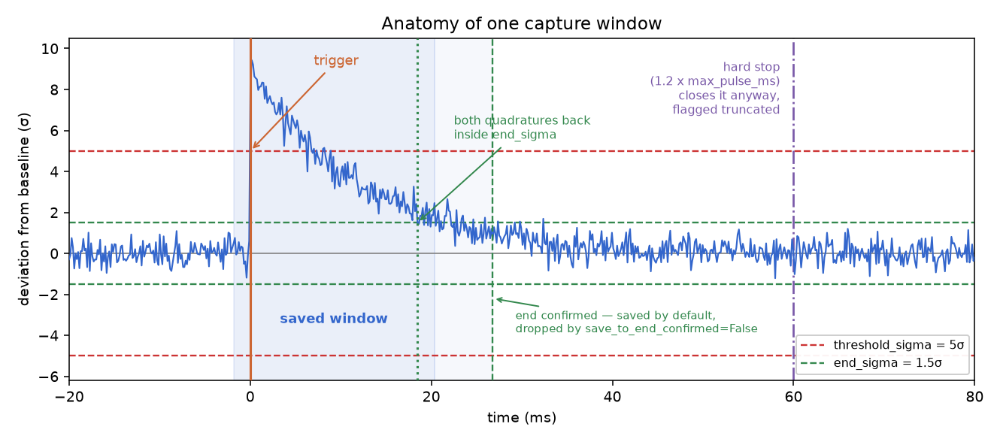
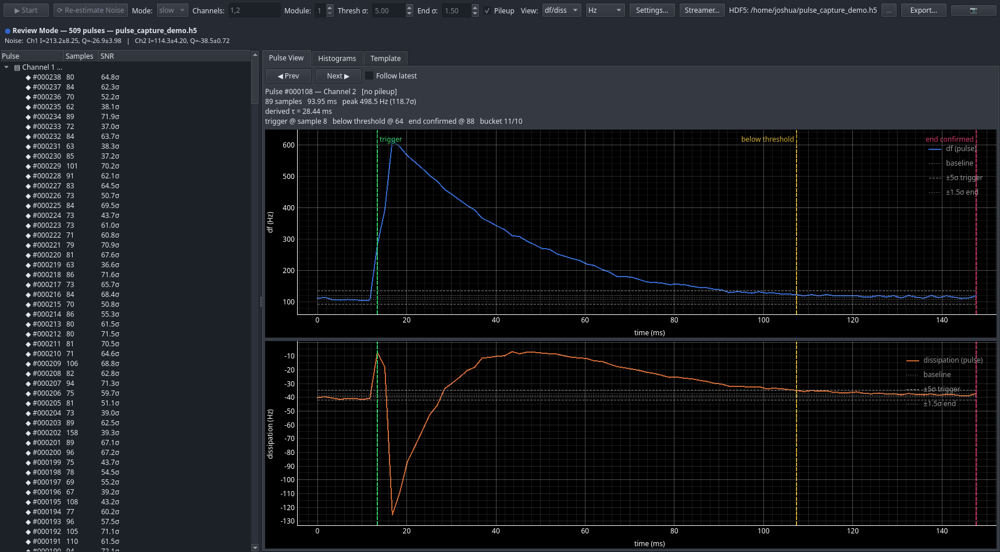
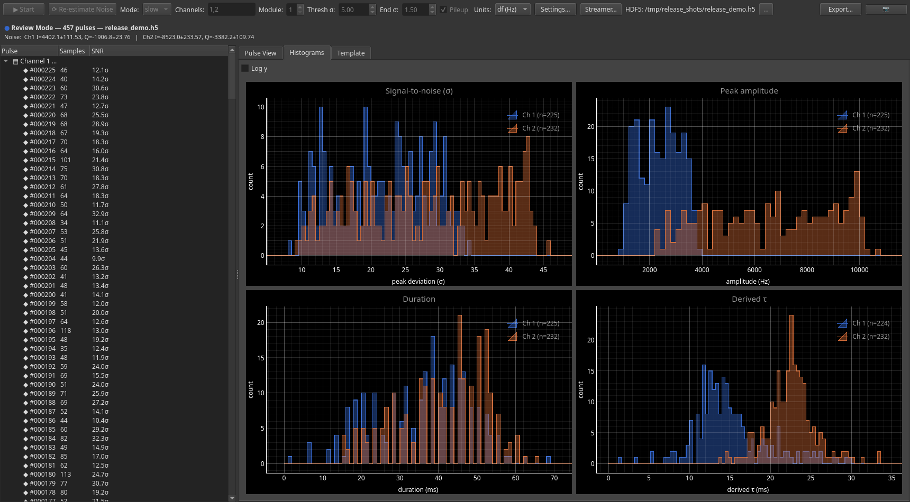

# Pulse Capture

This release adds pulse capture to rfmux: detecting transient events in a
detector timestream, recording them to HDF5, and reviewing them as they
arrive. It works headlessly from a script, interactively from Periscope, and
offline against the mock board.

The board streams, rfmux triggers on the stream, and you get a file of
individual pulses with their summary statistics already computed, instead of
a raw timestream to search afterwards.

## Capture pulses in one call

`trigger_capture` is a macro on the CRS object, so it is available on any
board you have resolved:

```python
from rfmux.pulse_capture import PulseCaptureConfig

result = await crs.trigger_capture(
    channel=[1, 2],
    module=1,
    streamer_mode="slow",
    time_run=15.0,
    config=PulseCaptureConfig(threshold_sigma=5.0, end_sigma=1.0),
    hdf5_path="capture.h5",
)

for ch in result.channels:
    print(ch, len(result.pulses[ch]), "pulses")
```

The call estimates the noise on each channel first, then triggers at
`threshold_sigma` above that baseline. Nothing needs to be known in advance
about the pulse height. Training takes twenty times `max_pulse_ms`, five
seconds at the default, and is not charged against `time_run`. The σ it
learns is the samples' scatter about a block-median baseline, measured
directly rather than inferred from adjacent differences, so it is right for
the correlated samples the decimators produce as well as for white noise.

`result` carries the pulses, their summaries and the noise statistics. The
same content is written to `hdf5_path` as the capture runs, so an interrupted
run keeps whatever it had already seen.

## Units, calibration and the frequency basis

Samples are stored in physical units, never in ADC counts. Without a df
calibration a channel is stored in volts, on the I and Q axes. With one it is
stored in hertz, along the frequency direction:

```python
result = await crs.trigger_capture(
    channel=[1], module=1, streamer_mode="slow", time_run=10.0,
    df_calibrations=df_cals,   # {channel: complex}, from bias_kids
)
```

The calibration is the complex `df_calibration` that `bias_kids` reports per
detector. Its phase is the angle from the (I, Q) axes to the frequency
direction; its magnitude is hertz per volt. A pulse moves the resonance
frequency, so it lies along that one direction in the IQ plane, at an angle
set by the bias point and the cable delay. Thresholding the raw quadratures
tests an arbitrary basis instead: at 45 degrees each one sees the pulse
divided by the square root of two while carrying the full noise.

The calibration is the slope of the resonance at the bias point. `bias_kids`
measures it where each detector ends up: every tone steps a twentieth of its
fitted linewidth down and up in lockstep, two reads for the module, and the
inverse of the complex slope is the calibration. The fit supplies only a
curvature correction of a percent or two. On the simulator the measured
direction is within 0.7 degrees of a true frequency step; a fitted resonance's
slope is within 4. The fit's version is kept alongside as
`df_calibration_fit`, and `bias_kids` warns when the two disagree by more than
5 degrees or 40 percent. Pass `measure_calibration=False` to use the fit's;
`calibration_step` sets the fraction. For the amplitude choice
and the bias frequency `bias_kids` works from one fit, chosen with
`fit_method`: the nonlinear IQ fit (the default) or the skewed Lorentzian.
Sweeps that already carry that fit (from Periscope's multisweep fit
checkboxes, or `fit_skewed_multisweep` / `fit_nonlinear_iq_multisweep`
headless) are used as they are; the rest are fitted then, about 20 ms each
for the nonlinear fit and 4 ms for the skewed. `multisweep` itself never
fits, so it stays the quick look. From the chosen fit come the bias
frequency (the max-diq or min-s21 point read off the fitted curve, not the
raw grid), the amplitude choice, and the calibration. In Periscope the Bias
KIDs dialog has the same choice, preselected to whatever fit the sweeps
carry. The multisweep's bias frequency method defaults to max-dIQ, headless
and in Periscope; it needs no fit of its own, since the multisweep reads that
point off the raw grid and `bias_kids` reads it off the fit. A resonance
biased into bifurcation has no such slope: the sweep jumps, `multisweep` and
`measure_df_calibrations` say so, and `bias_kids` still biases it, at the
lowest amplitude swept when it has a choice. With `optimize_phase=True`,
`bias_kids` also sets each detector's ADC phase so its timestream's principal
axis lies along Q, from one set of samples, and turns the calibration to
match, so samples times calibration is the same frequency shift either way.

Rotating before thresholding is therefore the default wherever a calibration
exists. Pass `trigger_basis="iq"` to threshold the raw quadratures anyway. A
channel with no calibration cannot be rotated, so it stays on the quadratures
and in volts, and one capture can hold both kinds.


| Attribute | Where | Meaning |
|---|---|---|
| `volts_per_count` | file metadata | the counts-to-volts constant the samples were converted with |
| `trigger_basis` | file metadata | `"df"` or `"iq"`: what the capture triggered on |
| `stored_units` | each channel group | `"Hz"` or `"V"` for that channel's samples |
| `df_calibration` | each channel group | the calibration used, if any |

`PulseHDF5Reader` exposes each of these, and the Periscope Units control
converts between counts, volts and hertz from them, so either view is exact
whatever the capture triggered on.

## How a pulse is detected



A capture opens when one axis leaves `threshold_sigma` and stays out for
`trigger_samples` in a row, and is higher than it was `edge_lookback` samples
earlier. The second condition is what keeps a slowly wandering baseline from
triggering: it compares two raw samples, so drift cancels out and only a fast
rise counts. Both counts are derived from the stream rate; at 596 Hz one
sample is ample evidence, at 2.44 MHz it is not.

The capture closes when both axes are back inside `end_sigma` and stay there,
for at least `min_end_samples`. The window that gets saved starts before the
trigger, so the rising edge is not clipped, and by default it stops a short
margin after the signal drops back below threshold. Set
`save_to_end_confirmed=True` to run it to that confirmation instead, keeping
the decay tail.

`max_pulse_ms` sets the longest pulse you expect. A capture still open at 1.2
times that is closed anyway. It is flagged `truncated` only when the signal
had not yet come back below threshold; a capture stopped because drift stalled
the end confirmation holds a complete pulse and is not flagged.
`min_pulse_ms` discards anything too short to be real.

Two overlapping pulses are split when the deviation, measured as the length of
the (df, dissipation) vector, rises sharply again while a capture is open.

## When each pulse happened

Every pulse carries `trigger_epoch` and `trigger_utc`, decoded from the packet
timestamps rather than the host clock, and the file records
`time_origin_epoch` and `time_origin_utc` for the capture as a whole. The
Periscope pulse list shows the UTC time of each trigger.

## See them live in Periscope

The Pulse Capture panel runs the same engine and draws each pulse as it is
detected. Open Periscope, add the panel, set the channels and thresholds in
the toolbar, and press Start.



The left pane lists every pulse with its length, signal-to-noise and trigger
time. The plot stacks the two axes against a common time axis, and markers
show the trigger sample, where the signal fell back below threshold, and
where the end was confirmed.

The capture above was triggered in the frequency basis, so the axes are df and
dissipation rather than I and Q, and the amplitudes are in hertz. The pulse is
in df, which is the point of rotating: it is a frequency excursion, and in the
raw quadratures it would be split between the two.

The panel also opens a finished file. Point it at an `.h5` and it enters
review mode, which is what the screenshot above shows. Captures written into
a session folder appear in the Session Browser and open from there.

For a fast or dual capture the panel does not configure the PFB streamer
itself. Set it up first through the Streamer Configuration dialog on the
toolbar; if the board is streaming different channels than the capture asks
for, the panel says so and stops rather than capturing the wrong ones.

### Histograms while you capture



Signal-to-noise, peak amplitude, duration and derived decay constant are
accumulated over every pulse and updated live. Ranges expand as new pulses
arrive, so there is nothing to configure up front.

With many channels the per-channel lines stop being readable, so the Plot
field on the histogram and template tabs says what to draw, in the same
language as the Channels field: `1,2,4` draws those channels, `1-5` combines
five channels into one histogram or template, and `*` combines them all.
Combined templates are stacked as if the pulses had been stacked together,
weighted by each channel's count.

One Units control in the toolbar drives the waveforms, the histograms and the
templates together. It offers counts, volts, and df in hertz; the last needs
a calibrated channel, the other two do not.

## Read the file back

```python
from rfmux.pulse_capture import PulseHDF5Reader

reader = PulseHDF5Reader("capture.h5")
print(reader.trigger_basis(), reader.volts_per_count())

for ch in reader.channels:
    print(ch, reader.pulse_count(ch), "pulses in", reader.stored_units(ch),
          reader.noise_stats(ch))

    for meta in reader.iter_pulse_metadata(ch):
        print(meta["pulse_idx"], meta["snr"], meta["duration_s"],
              meta.get("trigger_utc"))
```

`iter_pulse_metadata` reads only the summary fields, so it stays fast on a
file with tens of thousands of pulses. `get_pulse` loads one waveform when you
want the samples themselves.

## Capture the fast stream

The slow stream tops out at 38 kHz. For pulses faster than that, capture from
the polyphase filterbank instead:

```python
result = await crs.trigger_capture(
    channel=[1], module=1, streamer_mode="fast",
    time_run=0.25, hdf5_path="fast.h5",
)
```

The PFB stream runs at `PFB_SAMPLING_FREQ`, 2.44 MHz per channel, roughly
sixty times the fastest slow-stream rate. Four channels at once is the
firmware's limit, not a software one. It is also a lot of data, so a quarter
of a second is usually enough.

The receiver keeps up with that rate in C++, but the detection engine behind
it can still fall behind on a busy host. Rather than let the lag grow, the
source discards fast packets more than a quarter of a second old and counts
them: `lost_packets` and `flushed_packets` in the session's `source`
statistics, shown on the panel's status line alongside how busy the source
is. A capture that receives no fast packets at all raises `TimeoutError`
instead of waiting.

The socket asks the kernel for the largest receive buffer it allows, so raise
`net.core.rmem_max` before a long fast capture; the
[Networking Guide](../guides/networking.md) has the numbers.

## Both streams at once

`streamer_mode="both"` runs a slow and a fast capture together and matches
pulses between them:

```python
result = await crs.trigger_capture(
    channel=[1], module=1, streamer_mode="both",
    time_run=2.0, hdf5_path="dual.h5",
)

print(len(result.pairs), "matched pairs")
```

Each stream is also reachable on its own as `result.slow` and `result.fast`.
The matching is the reason to run both. The slow stream gives a long clean
baseline, and the fast stream resolves the rise. The pairs tie the two views
of one event together.

Two triggers pair when they fall within three slow samples of each other,
half the slow stream's filter response. A trigger with no partner is held
until the longest capture could have closed, plus 50 ms, then released as a
one-sided pair. Every pair, one-sided or not, carries both streams over one
common interval, the union of the two records, written as `window_t0` and
`window_t1`; metrics are still computed from each stream's own triggered
samples.

The slow stream's timestamps are late by its decimation filter's group delay
while the fast stream's are not, so the slow clock is shifted back by that
delay before matching and before writing. The shift is recorded as
`slow_time_offset_s`, which is what to add back if you compare against raw
packet timestamps. `window_shortfall` in `rfmux.pulse_capture.analysis`
reports when a pair's fast record is shorter than its window, which is what
lost fast packets look like.

## Check the link budget before you configure

Streaming two PFB channels alongside four modules of slow data does not fit in
1 GbE. `streamer_config` works out whether a configuration fits:

```python
from rfmux.algorithms.measurement.streamer_config import StreamerConfig, validate

cfg = StreamerConfig(dec_stage=0, short_packets=True,
                     pfb_channels=[1, 2], pfb_module=1)

for severity, message in validate(cfg):
    print(severity, message)
```

Stage 0 needs short packets: at the full 38 kHz a long packet of 1024
channels is ten times what the link carries. Periscope exposes the same check
through the Streamer Configuration dialog, reachable from the Pulse Capture
toolbar.

## Try it without a board

Everything above works against the mock. The mock injects pulses of a
configurable shape and rate, so you can develop against it:

```python
from rfmux.mock.helpers import create_mock_crs

crs = await create_mock_crs(module=1, config={
    "num_resonances": 2,
    "resonator_random_seed": 42,
    "auto_bias_kids": True,
    "pulse_mode": "periodic",
    "pulse_period": 0.25,
    "pulse_tau_rise": 5e-3,
    "pulse_tau_decay": 25e-3,

    # A spread of heights rather than one repeated event.  Leave these
    # out and every pulse is "pulse_amplitude".
    "pulse_random_amp_mode": "uniform",
    "pulse_random_amp_min": 1.1,
    "pulse_random_amp_max": 1.5,
})
```

Match the decay constant to the rate you are sampling at. The default
decimation gives 596 Hz, so a sample every 1.68 ms, and the 25 ms decay above
is about fifteen samples long. A decay shorter than the sample period lands
inside one sample and is detected but not resolved, which looks like a single
spike rather than a pulse.

`auto_bias_kids` is the simulation's own tuning: it sweeps each resonator at
`bias_amplitude`, a tone power of -55 dBm by default, and biases it at the
S21 minimum it finds. That gives biased resonators, not a df calibration, so
`measure_df_calibrations(module=1)` measures one for every biased channel
afterwards; Periscope does this itself at startup in mock mode, behind the
build progress window for arrays above 25 resonators and in the background
for smaller ones. Both work headlessly: `create_mock_crs` runs the auto-bias
as part of the build, and the notebook calls `measure_df_calibrations`.

`periscope --mock` gives the same simulation behind the GUI. The screenshots
in this document were taken from a mock capture, triggered in the frequency
basis, by `docs/make_release_note_screenshots.py`, with the config above.

The mock generates both streams in one process, so fast and dual captures run
slower than real time: two PFB channels is 4.9 M complex samples a second to
synthesise. Slow-stream captures keep up. This affects only the simulation.

Resonators in the mock carry 1/f frequency wander with a configurable
amplitude and corner, which is what a real detector looks like at low
frequency. It is set from the same config dictionary and from the Mock
Configuration dialog, and it is what the baseline tracking above has to cope
with.

## Known limitations

- In `"both"` mode the two detection engines share one event loop, so a slow
  host that cannot keep up with the fast stream also delays the slow one.

## Where to go next

- [Pulse Capture notebook](../../rfmux/reference-notebooks/Demos/pulse_capture.md)
  is the full explanation, with runnable cells. Open it from the Jupyter panel
  Periscope launches, or right-click it in JupyterLab and choose Open With →
  Notebook.
- [`pulse_capture_flow.py`](../../rfmux/reference-notebooks/Demos/pulse_capture_flow.py)
  is the same sequence as a plain script. Read it as a reference for your own
  code, or run it against `MOCK` to check a change end to end.
- [Networking Guide](../guides/networking.md) covers the UDP buffer sizing
  that long captures need.
