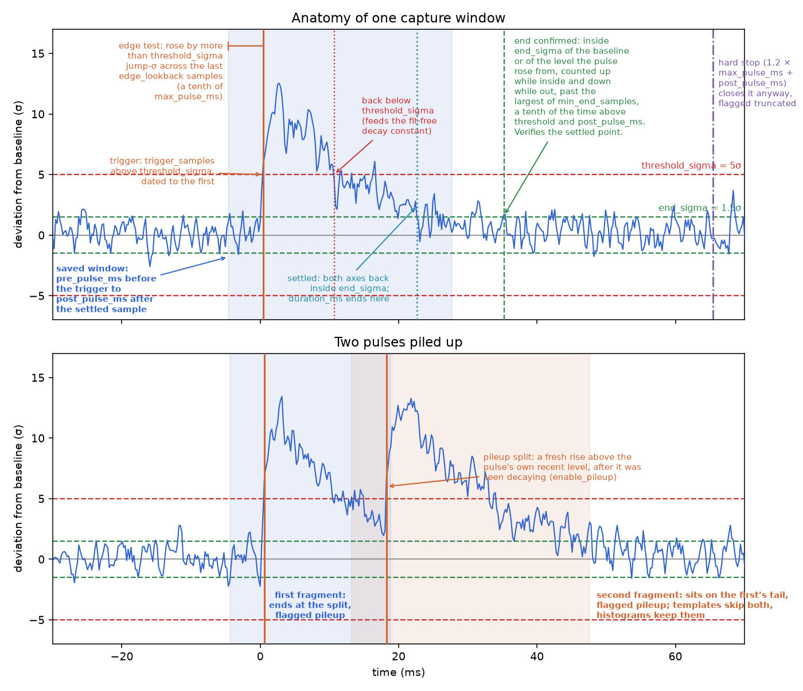

---
jupyter:
  kernelspec:
    display_name: Python 3 (ipykernel)
    language: python
    name: python3
---

# Pulse Capture

End-to-end pulse capture from the Python API: configure the streamers, detect
pulses live, persist them, and analyse them — **without opening Periscope**.

Everything here is the same code path Periscope's *Pulse Capture* panel drives.
The panel builds a `PulseCaptureSession`, feeds it from the streamers, and draws
the callbacks; this notebook builds the same session, feeds it with the same
source functions, and prints or plots instead. There is no capability in the GUI
that is unavailable here.

Everything under `rfmux.pulse_capture` is also re-exported from the package
itself, so `from rfmux.pulse_capture import PulseCaptureSession` works and is
what the import cell below uses. The per-module paths are listed for orientation.

| Piece | Module |
|---|---|
| Streamer setup + link-budget math | `rfmux.algorithms.measurement.streamer_config` |
| Detection engine (ring buffer, triggering) | `rfmux.pulse_capture.detection` |
| Live capture orchestration | `rfmux.pulse_capture.capture_session` |
| Concurrent slow+fast with matching | `rfmux.pulse_capture.capture_session` |
| Packet sources that feed a session | `rfmux.pulse_capture.sources` |
| Per-pulse metrics (SNR, derived τ) | `rfmux.pulse_capture.analysis` |
| Streaming HDF5 persistence | `rfmux.pulse_capture.hdf5` |

## How to use this document

Run the cells in order; later ones use variables the earlier ones defined.
Section 1 is the exception: it offers three ways to get a CRS, and you run only
the one that fits.

This format saves no outputs, so every number you see is one you just produced.
The shipped copy is read-only: *File → Save Notebook As…* to keep changes.

Captures are written to `OUTPUT_DIR`, printed by the next cell. Section 7 reads
them back, and Periscope can open them in review mode.

```python
%matplotlib inline

import asyncio
import os
import tempfile
from pathlib import Path

import numpy as np
import matplotlib.pyplot as plt

import rfmux
from rfmux.pulse_capture import (
    DualPulseCaptureSession, PulseCaptureConfig, PulseCaptureSession,
    PulseHDF5Reader, counts_to_hz_scale,
    run_dual_source, run_pfb_source, run_slow_source,
)
from rfmux.core.transferfunctions import (
    PFB_SAMPLING_FREQ, decimation_to_sampling,
)
from rfmux.algorithms.measurement.streamer_config import (
    StreamerConfig, describe, validate,
)

# Captures are written here. Reference notebooks are provisioned to a
# read-only directory, so writing next to the notebook would fail for anyone
# who opened it from Periscope — default to a writable scratch directory and
# say where it is. Override with RFMUX_DEMO_OUTPUT.
OUTPUT_DIR = Path(os.environ.get(
    "RFMUX_DEMO_OUTPUT", Path(tempfile.gettempdir()) / "rfmux_pulse_capture"))
OUTPUT_DIR.mkdir(parents=True, exist_ok=True)

MODULE = 1
CHANNELS = [1, 2]

crs = None          # set by whichever cell in section 1 or 2 you run
host = "127.0.0.1"  # where the streamers send
IS_MOCK = False     # True only if THIS notebook created the simulation

print(f"capture files → {OUTPUT_DIR}")
```

## 1. Connect

Everything below needs a CRS. **Run exactly one** of the three options:

| | When to use it | Where |
|---|---|---|
| **A. An existing Mock or Real Periscope session is already running** | Periscope launched the Jupyter environment you are viewing this notebook within, and it is already configured for either a real board or a mock instance | below |
| **B. Starting from scratch with real hardware** | You have a CRS and this notebook is being viewed separately from Periscope | below |
| **C. Start a new simulated environment** | No Periscope GUI instance already, and nothing already running | section 2 |

### A. Attach to a real or mock CRS instance that is already loaded with Periscope

Use this when Periscope is driving a board — real or simulated — and you want to
work with *that* one rather than starting your own.

Periscope sets `RFMUX_CRS_HOSTNAME` when it launches this notebook, which is how
the cell finds the board with no configuration from you.

Attaching matters most if you have already configured Periscope in mock mode.
A second `create_mock_crs()` gives you a *second, unrelated* simulation,
whose detectors are not the ones Periscope is showing you.

```python
HOSTNAME = os.environ.get("RFMUX_CRS_HOSTNAME")   # or paste "127.0.0.1:43431"
SERIAL = os.environ.get("RFMUX_CRS_SERIAL", "0000")

if HOSTNAME:
    s = rfmux.load_session(
        f'!HardwareMap [ !CRS {{ serial: "{SERIAL}", '
        f'hostname: "{HOSTNAME}" }} ]')
    crs = s.query(rfmux.CRS).one()
    await crs.resolve()
    print(f"attached to CRS {SERIAL} at {HOSTNAME}")
else:
    print("Nothing advertised a board. Set HOSTNAME above, or use option B "
          "(your own board) or section 2 (simulation).")
```

### B. Your own board, no Periscope GUI

```python
# SERIAL = "0042"
# s = rfmux.load_session(f'!HardwareMap [ !CRS {{ serial: "{SERIAL}" }} ]')
# crs = s.query(rfmux.CRS).one()
# await crs.resolve()
# await crs.set_timestamp_port(crs.TIMESTAMP_PORT.TEST)
# print(f"connected to CRS {SERIAL}")
```


## 2. Mock mode configuration

**Skip this section entirely if section 1 already gave you a CRS** — the cell
below no-ops in that case.

If you have no hardware, this stands up a simulated CRS: two resonators
biased and carrying tones, and periodic quasiparticle pulses to detect.

Pulse heights are drawn uniformly between `pulse_random_amp_min` and
`pulse_random_amp_max`, so the amplitude histogram in section 7 shows a
distribution rather than a single spike.

The noise is deliberately not idealised:

- **White readout noise** (`udp_noise_level`): the flat floor the σ thresholds
  are measured against.
- **Quasiparticle number fluctuations** (`nqp_noise_enabled`): physical
  generation–recombination noise in the resonator itself. It dominates the
  slow-stream floor at these settings, so `threshold_sigma` is measured against
  real detector noise rather than a readout artefact.
- **TLS 1/f frequency noise** (`tls_noise_enabled`): two-level systems in the
  substrate make the resonant frequency wander with a `1/f**alpha` spectrum.
  Being correlated rather than white, it moves the baseline slowly instead of
  scattering samples around it. That slow movement is what the trigger in
  section 4 has to cope with; a fixed baseline would trigger on it endlessly.

> ⚠️ **This cell refuses to run if something is already streaming.** Two
> simulations send to the same UDP port, so a receiver gets both interleaved —
> no exception, no dropped packets, just samples from two unrelated detectors in
> one trace. Rather than leave that to be noticed later, the cell checks and
> stops, and the message says which case you are in. If Periscope is in mock
> mode, attach to *its* simulation with option 1A instead.

```python
MOCK_CONFIG = {
    "num_resonances": 2,
    "resonator_random_seed": 42,
    "auto_bias_kids": True,        # bias the detectors
    "bias_amplitude": 0.001,

    # ── Noise (these are the shipped defaults, spelled out) ─────
    "udp_noise_level": 10.0,       # white readout noise (ADC counts)
    "nqp_noise_enabled": True,     # quasiparticle generation-recombination
    "nqp_noise_std_factor": 0.01,  # 1% of base quasiparticle density
    "tls_noise_enabled": True,     # TLS 1/f frequency wander
    "tls_fractional_rms": 1e-7,    # RMS of df/f
    "tls_alpha": 1.0,              # PSD ~ 1/f**alpha
    "tls_corner_hz": 100.0,        # upper corner; law spans 3 decades below

    # ── Pulses to detect ────────────────────────────────────────
    "pulse_mode": "periodic",
    "pulse_period": 0.05,          # one every 50 ms
    "pulse_tau_rise": 1e-6,
    "pulse_tau_decay": 1e-3,       # 1 ms decay constant
    "pulse_random_amp_mode": "uniform",   # spread of pulse heights,
    "pulse_random_amp_min": 1.5,          # not one repeated event
    "pulse_random_amp_max": 3.0,
}

if crs is not None:
    print("already connected — skip this cell")
else:
    from rfmux.streamer import find_streamer_conflict

    if os.environ.get("RFMUX_CRS_HOSTNAME"):
        raise RuntimeError(
            "Periscope launched this notebook and is already driving a CRS.\n"
            "Run option 1A above to attach to that one. Creating a second "
            "simulation here would stream to the same UDP port as Periscope's, "
            "and every reader would see the two interleaved.")

    conflict = find_streamer_conflict()
    if conflict:
        raise RuntimeError(
            f"Something is already using the streamer port — {conflict}.\n"
            "A second simulation would send to that same port, and a reader "
            "would get both streams interleaved with nothing to say so.\n"
            "Attach to what is running with option 1A, or stop it, then re-run "
            "this cell.")

    from rfmux.mock.helpers import create_mock_crs
    crs = await create_mock_crs(module=MODULE, config=MOCK_CONFIG,
                                verbose=False)
    IS_MOCK = True
    host = "127.0.0.1"
    print(f"simulated CRS ready: {MOCK_CONFIG['num_resonances']} resonators, "
          f"1/f on (df/f = {MOCK_CONFIG['tls_fractional_rms']:.0e} rms)")
```

### Confirm the connection

The rest of the notebook uses `crs`; this fails early if section 1 did not
set it.

```python
if crs is None:
    raise RuntimeError(
        "No CRS. Run option 1A (attach), 1B (your board), or the cell above "
        "(simulate one) before continuing.")

print(f"CRS       {crs.tuber_hostname}")
print(f"streamers {host}")
print(f"module {MODULE}, channels {CHANNELS}")
print("simulation created by this notebook" if IS_MOCK
      else "pre-existing board — this notebook will not tear it down")
```

## 3. Configure the streamers

Two streams carry data off the board:

- the **slow** readout stream, decimated in stages from ~38 kHz down to ~596 Hz,
  carrying up to 1024 channels per module (port 9876);
- the **fast** PFB stream at ~2.44 MHz, limited to 4 channels of one module
  (port 9877).

Which of these streams, and at what decimation, you choose depends on the detector
properties. You want roughly **10 or more samples across one pulse decay constant**,
or else the decay is too sparsely sampled to fit. Below that the pulse is a spike; 
far above it you are oversampling the pulse.

`validate()` reports the hardware rules (long packets need stage ≥ 3, the 1 GbE
budget, OS receive-buffer advice) as `(severity, message)` pairs. `describe()`
returns the derived rates and link budget.

> If you attached to Periscope's CRS in section 1, remember the streamer is a
> shared resource: changing the decimation here changes it for Periscope's plots
> too, exactly as the *Streamer…* dialog would. 

```python
PULSE_TAU_S = 1e-3          # expected decay constant

needed_fs = 10.0 / PULSE_TAU_S
dec = next(d for d in range(6, -1, -1) if decimation_to_sampling(d) >= needed_fs)
cfg = StreamerConfig(dec_stage=dec, short_packets=(dec < 3), modules=[MODULE])

print(f"τ = {PULSE_TAU_S*1e3:.1f} ms → need ≥ {needed_fs:.0f} Hz "
      f"→ stage {dec} ({decimation_to_sampling(dec):.0f} Hz)")

# Check the link budget BEFORE touching the board
budget = describe(cfg)
print(f"{budget['channels_per_module']} ch/module × {budget['n_modules']} "
      f"module(s) at {budget['sample_rate_hz']:.0f} Hz "
      f"= {budget['total_mbps']:.0f} Mbps of 1 GbE")
for severity, message in validate(cfg):
    print(f"  [{severity}] {message}")

info = await crs.configure_streamer(cfg.dec_stage, short=cfg.short_packets,
                                    modules=cfg.modules)
info
```

```python
if IS_MOCK:
    # The simulated streamer needs a moment to fill after a rate change.
    await crs.start_udp_streaming()
    await asyncio.sleep(2.0)
```

### Choosing channels

Periscope's **Channels** field and this notebook take the same strings, because
they call the same parser. Single channels, inclusive ranges, or a mix:

```python
from rfmux.algorithms.measurement.channel_selection import parse_channel_spec

for spec in ("1,2", "2-19", "1,5-8,20"):
    print(f"{spec!r:12} -> {parse_channel_spec(spec)}")
```

`all` (or `*`) is deliberately *not* a list — it means "ask the board", which
only the board can answer, so the parser returns `None` and leaves the question
to `get_biased_channels`. That reads every channel's amplitude in one batched
round trip rather than one RPC per channel, and drops any channel the packet
cannot carry:

```python
print(f"{'all'!r:12} -> {parse_channel_spec('all')}   (resolve against the board)")

# 128 is the short-packet width: a channel above it is in no packet, however
# it is biased.  Pass the width you are actually streaming.
biased = await crs.get_biased_channels(MODULE, max_channels=128)
print(f"biased on module {MODULE}: {len(biased)} channel(s)")
print(f"  {biased[:12]}{' ...' if len(biased) > 12 else ''}")
```

Whatever you choose, `CHANNELS` below is just a list of ints — set it from a
spec, from `get_biased_channels`, or by hand.

## 4. Choose the detection parameters

`PulseCaptureConfig` holds every user-facing parameter in **physical units**
(σ and milliseconds). It converts them to samples for whatever stream rate you
hand it, which is what lets one configuration work unchanged across a 4000×
span of rates from the decimated slow stream to the PFB stream.

How the detector works:

- **A capture opens on either I or Q, and closes only when both have settled.**
  It opens when either leaves ±`threshold_sigma`, and closes when both are back
  inside ±`end_sigma`. `end_sigma` must sit below `threshold_sigma`, or a
  capture would end where it began.
- **Triggers must be confirmed.** `trigger_samples` consecutive samples have to
  clear the threshold. Left at 0 it is *derived from the stream rate* to hold
  accidental triggers under `max_accidental_per_min`: at 596 Hz one sample is
  ample evidence, at 2.44 MHz it is not.
- **A trigger also needs a fast rise.** As well as crossing the threshold, the
  signal must be higher than it was `edge_lookback` samples ago. That compares
  two raw samples instead of measuring against the baseline, so a slow drift
  cancels out of it: only a fast rise can trigger, however far behind the
  baseline estimate has fallen.
- **The baseline is a rolling median**, re-estimated continuously over
  `baseline_window` samples. A median rather than a mean because it ignores
  pulses as long as they stay a minority of the window.
- **`max_pulse_ms` is the primary control.** It sizes the ring buffer at 1.5× the
  longest pulse, leaving room for the samples before the trigger and the tail
  after it, and sets the floor under the baseline window and the noise training
  length. Estimate it *generously*: a
  capture that outlasts the ring silently loses its own rising edge.
- **A capture that never ends is cut off.** If the signal never comes back
  below `end_sigma`, the capture stops at 1.2 × `max_pulse_ms` and is flagged
  `truncated`.



The shaded region is what gets saved. It opens `margin_fraction` of the window
before the trigger — 10% by default, too small to draw legibly here — so the
record keeps some pre-trigger baseline to measure against rather than starting
exactly at the crossing.

Where it *closes* is `save_to_end_confirmed`, on by default: the window runs to
the end-of-pulse confirmation, keeping the whole decay tail. Those samples are
already in the ring, so this costs disk rather than acquisition. Turn it off and
the window stops a `margin_fraction` tail past the below-threshold instant
instead: shorter files, and window length becomes a property of the pulse rather
than of the baseline, since how long the confirmation takes depends on where the
baseline was wandering. On the mock at 19 kHz with a 1 ms decay, keeping the tail
makes windows about 40% longer.

Worth turning off for PFB captures, where windows already carry ~64× the samples,
and at high count rates, where longer windows overlap and more events get flagged
as pileup.

`duration_ms` does not change either way: it is measured from the threshold
crossings, not from the length of the saved window.

`describe()` reports everything derived at a given rate, and `validate()` catches
inconsistent settings before you spend a capture on them.

```python
capture_config = PulseCaptureConfig(
    threshold_sigma=5.0,    # trigger when I or Q leaves ±5σ
    end_sigma=1.5,          # close when BOTH are back inside ±1.5σ
    min_pulse_ms=0.2,       # glitch filter: drop anything shorter
    max_pulse_ms=50.0,      # longest recordable pulse — sizes the ring
    noise_train_ms=50.0,    # 0 would derive this from max_pulse_ms
    enable_pileup=True,     # split piled-up events on a sharp re-rise
)

fs = decimation_to_sampling(cfg.dec_stage)
for severity, message in capture_config.validate(fs):
    print(f"  [{severity}] {message}")

d = capture_config.describe(fs, n_channels=len(CHANNELS))
print(f"\nAt {d['sample_rate_hz']:.0f} Hz:")
print(f"  ring buffer     {d['buf_samples']:,} samples "
      f"({d['buf_mb_total']:.2f} MB total, "
      f"{d['max_recordable_ms']:.0f} ms max)")
print(f"  noise training  {d['noise_samples']:,} samples "
      f"({d['noise_train_actual_ms']:.0f} ms)")
print(f"  baseline median {d['baseline_window']:,} samples "
      f"({d['baseline_window_ms']:.0f} ms)")
print(f"  trigger confirm {d['trigger_samples']} sample(s) → "
      f"{d['accidental_per_min']:.2e} accidentals/min/channel")
print(f"  edge lookback   {d['edge_lookback']} samples "
      f"({d['edge_lookback_ms']:.1f} ms)")
print(f"  capture limit   {d['max_capture_ms']:.0f} ms")
```

Note how the confirmation length changes on its own with the rate — this is the
mechanism that makes one config portable across streams:

```python
for rate, label in [(596.0, "slow, stage 6"), (fs, f"slow, stage {dec}"),
                    (PFB_SAMPLING_FREQ, "fast (PFB)")]:
    dd = capture_config.describe(rate)
    print(f"{label:<18} {rate:>10,.0f} Hz → confirm "
          f"{dd['trigger_samples']} sample(s), "
          f"{dd['accidental_per_min']:.2e} accidentals/min")
```

## 5. One-shot capture

`trigger_capture` is an in-memory version of pulse capture.
It is suitable for bounded runs that can be held entirely within RAM, but
quickly becomes unsuitable for long capture sessions.

`streamer_mode` is `"slow"`, `"fast"` (PFB, ≤ 4 channels) or `"both"`. Noise
training runs first and is *not* charged against `time_run`.

```python
res = await crs.trigger_capture(
    channel=CHANNELS, module=MODULE,
    streamer_mode="slow",
    time_run=2.0,               # seconds of SAMPLE time, not wall clock
    threshold_sigma=5.0,
    end_sigma=1.5,
)

for ch in res.channels:
    n = res.noise[ch]
    print(f"ch{ch}: {len(res.pulses[ch])} pulses, "
          f"I={n.mean_I:.0f}±{n.std_I:.2f}")
res
```

Because it is a session underneath, `hdf5_path=` makes the one-shot call write a
real capture file, which includes pulses, histograms and templates, openable in Periscope.
Use a session directly (next section) when a capture is long enough that holding
every pulse in memory stops being reasonable.

Each pulse comes with its metrics already computed. `res.summaries[ch][idx]` is
`pulse_summary()` output.

```python
ch = CHANNELS[0]
idx = min(res.pulses[ch])
pulse = res.pulses[ch][idx]

print({k: (round(v, 4) if isinstance(v, float) else v)
       for k, v in res.summaries[ch][idx].items()})

t_ms = (pulse["Time"] - pulse["Time"][0]) * 1e3
plt.figure(figsize=(8, 3))
plt.plot(t_ms, pulse["Amp_I"], label="I")
plt.plot(t_ms, pulse["Amp_Q"], label="Q")
plt.xlabel("time (ms)"); plt.ylabel("counts")
plt.title("One captured pulse"); plt.legend(); plt.show()
```

The derived τ is worth understanding, because it is not a fit. It uses two
well-measured points on the falling edge — the peak, and the moment the envelope
falls back through the trigger threshold:

$$\tau = \frac{t_{\rm thr} - t_{\rm peak}}{\ln(\mathrm{SNR}_{\rm peak} / \sigma_{\rm thr})}$$

Taking the *ratio* of amplitudes cancels the unknown event energy, so for a
detector with one decay time every energy line collapses onto a single τ. It is
a live cross-check, not a precision measurement: the discrete crossing sample
lands slightly below the true crossing, so it runs a few percent low.

## 6. Live capture with streaming persistence

`PulseCaptureSession` is what the panel actually runs. It trains on noise, then
detects, and as each pulse closes it appends to HDF5, updates running histograms
and stacks a trigger-aligned template. Since this is incremental, memory stays flat
no matter how long you capture.

You feed it from `run_slow_source` / `run_pfb_source`, or from any sample source
of your own: the session's interface is just `feed_sample(channel, I, Q, t)`.

`on_pulse` is the callback the GUI uses to update its display. Here it prints.

```python
def on_pulse(channel, pulse_idx, summary, waveform):
    if pulse_idx <= 3:       # keep the output short
        print(f"  ch{channel} #{pulse_idx}: {summary['snr']:.0f}σ, "
              f"{summary['duration_ms']:.2f} ms, τ={summary['tau_ms']:.2f} ms")

capture_session = PulseCaptureSession(
    channels=CHANNELS, module=MODULE, streamer_mode="slow",
    sample_rate=fs, hdf5_path=str(OUTPUT_DIR / "pulse_capture_demo.h5"),
    on_pulse=on_pulse,
    **capture_config.session_kwargs(fs),
)
capture_session.start()
covered = await run_slow_source(capture_session, host, module=MODULE,
                               duration_s=3.0)
capture_session.stop()

print(f"\n{capture_session.total_pulses} pulses over {covered:.2f} s of sample time")
print(f"rolling baseline median over {capture_session.baseline_window:,} samples "
      f"({capture_session.baseline_window / fs:.2f} s)")
```

`duration_s` counts **sample time** accumulated from packet timestamps, not wall
clock, so a capture covers the span you asked for even if packets arrive late.
Pass `should_stop=<callable>` instead to run until you decide to stop.

## 7. Read the capture back

The file holds every pulse waveform, the running histograms, the templates, and
the noise statistics and capture parameters as attributes. Periscope opens these
same files in review mode (double-click in the Session Browser).

```python
reader = PulseHDF5Reader(OUTPUT_DIR / "pulse_capture_demo.h5")
print("channels:", reader.channels)
print("threshold_sigma:", reader.metadata["threshold_sigma"],
      "| sample rate:", f"{reader.metadata['sample_rate_slow']:.0f} Hz")

for ch in reader.channels:
    n = reader.noise_stats(ch)
    print(f"  ch{ch}: {reader.pulse_count(ch)} pulses, "
          f"noise I={n.mean_I:.0f}±{n.std_I:.2f}, Q={n.mean_Q:.0f}±{n.std_Q:.2f}")

# Per-pulse metadata without loading any waveforms
for meta in list(reader.iter_pulse_metadata(reader.channels[0]))[:5]:
    print(f"  #{meta['pulse_idx']:04d} snr={meta.get('snr', 0):.0f}σ "
          f"dur={meta.get('duration_s', 0)*1e3:.2f} ms "
          f"τ={meta.get('tau_s', float('nan'))*1e3:.2f} ms")
```

Histograms accumulate as the capture runs and expand their ranges automatically
when a pulse falls outside the current binning, so you never have to guess the
scale in advance. Keys are `<metric>_edges`, `<metric>_bins` (centers) and
`<metric>_counts_ch<N>`.

```python
hist = reader.get_histograms()
fig, axes = plt.subplots(1, 3, figsize=(13, 3))
for ax, metric, xlabel in zip(
        axes, ["snr", "amplitude", "tau_ms"],
        ["peak deviation (σ)", "amplitude (counts)", "derived τ (ms)"]):
    edges = hist.get(f"{metric}_edges")
    for ch in reader.channels:
        counts = hist.get(f"{metric}_counts_ch{ch}")
        if edges is None or counts is None:
            continue
        centers = 0.5 * (edges[:-1] + edges[1:])
        keep = counts > 0
        ax.bar(centers[keep], counts[keep],
               width=(edges[1] - edges[0]), alpha=0.6, label=f"ch{ch}")
    ax.set_xlabel(xlabel); ax.set_ylabel("count"); ax.legend()
plt.tight_layout(); plt.show()
```

### Trigger-aligned template

Every pulse is stacked on its **trigger crossing**, not on the start of its
window — window starts carry a pre-margin that varies with pulse length, so
stacking on them would smear the template. The mean beats the noise down as
1/√N; the shaded band is the per-bin RMS spread, which is what separates real
pulse-to-pulse variation from measurement noise.

```python
tmpl = reader.get_templates()
plt.figure(figsize=(8, 3.5))
for ch in reader.channels:
    t = tmpl.get(f"time_s_ch{ch}")
    mean = tmpl.get(f"template_I_ch{ch}")
    resid = tmpl.get(f"residual_I_ch{ch}")
    if t is None or mean is None:
        continue
    n = int(np.nanmax(tmpl[f"counts_ch{ch}"]))
    plt.plot(t * 1e3, mean, label=f"ch{ch} template (n={n})")
    if resid is not None:
        plt.fill_between(t * 1e3, mean - resid, mean + resid, alpha=0.25)
plt.axvline(0, color="k", lw=0.8, ls=":")
plt.xlabel("time from trigger (ms)"); plt.ylabel("I (counts)")
plt.title("Trigger-aligned template"); plt.legend(); plt.show()
```

### Calibrated amplitudes

Waveforms are stored in raw ADC counts, which are only comparable across
channels once calibrated. `counts_to_hz_scale` turns them into Δf, and is the
same conversion behind the panel's counts/Hz selector.

The calibration itself comes from `bias_kids`, which returns a `df_calibration`
(Hz per radian) per detector. Hand those to the session and they are written
into the capture file alongside the pulses:

    bias_results = await bias_kids(crs=crs, multisweep_results=...,
                                   module=MODULE)
    df_cals = {ch: d["df_calibration"] for ch, d in bias_results.items()
               if "df_calibration" in d}

    capture_session = PulseCaptureSession(..., df_calibrations=df_cals)

This notebook's mock detectors were biased by `auto_bias_kids`, which skips that
sweep-and-fit step, so the channels below are uncalibrated and
`counts_to_hz_scale` returns `None`. Treat `None` as "show counts" rather than
substituting 1.0 — unscaled counts mislabelled as Hz are worse than no
calibration at all.

```python
for ch in reader.channels:
    scale = counts_to_hz_scale(reader.df_calibration(ch))
    if scale is None:
        print(f"  ch{ch}: uncalibrated — amplitudes stay in counts")
    else:
        peak = reader.get_pulse_metadata(ch, 1).get("peak_amp", float("nan"))
        print(f"  ch{ch}: {peak:.0f} counts → {peak * scale:.1f} Hz")

reader.close()
```

## 8. Fast (PFB) capture

The fast streamer carries up to **4 channels of one module** at ~2.44 MHz —
about 128× the slow stream here, enough to resolve a rise time the slow stream
sees as a single sample. Enable it through `configure_streamer`, and always tear
it down in a `finally` so a failed capture doesn't leave it running.

The same `PulseCaptureConfig` is reused: `session_kwargs(PFB_SAMPLING_FREQ)`
re-derives the buffer, training length and confirmation count for the new rate.

```python
await crs.configure_streamer(cfg.dec_stage, short=cfg.short_packets,
                             modules=[MODULE],
                             pfb_channels=CHANNELS, pfb_module=MODULE)
try:
    fast_session = PulseCaptureSession(
        channels=CHANNELS, module=MODULE, streamer_mode="fast",
        sample_rate=PFB_SAMPLING_FREQ,
        hdf5_path=str(OUTPUT_DIR / "pulse_capture_fast.h5"),
        **capture_config.session_kwargs(PFB_SAMPLING_FREQ),
    )
    fast_session.start()
    covered = await run_pfb_source(fast_session, host, CHANNELS,
                                   duration_s=0.25)
    fast_session.stop()
    print(f"{fast_session.total_pulses} pulses over {covered*1e3:.0f} ms")
finally:
    await crs.configure_streamer(cfg.dec_stage, short=cfg.short_packets,
                                 modules=[MODULE], pfb_channels=[])
```

## 9. Both streams at once, with matched pairs

`DualPulseCaptureSession` runs two independent pulse detection engines for fast
and slow samples, each with its own noise training and rate-appropriate parameters.
It and matches their pulses by trigger time. `run_dual_source` drives both sockets
concurrently; whichever side finishes first stops the other, since a matcher fed by one stream
alone just accumulates one-sided pulses.

Each matched pair also stores a common time span: the widest interval either
trigger covers, taken from both ring buffers. That gives you the same event at
19 kHz and at 2.44 MHz over the same interval, which is what makes the two
comparable. Metrics are still computed from each stream's own triggered samples,
so the wider span does not affect them.

```python
pairs = []

dual = DualPulseCaptureSession(
    channels=CHANNELS, module=MODULE,
    slow_rate=fs, fast_rate=PFB_SAMPLING_FREQ,
    config=capture_config,
    hdf5_path=str(OUTPUT_DIR / "pulse_capture_dual.h5"),
    on_pair=lambda p: pairs.append(p),
)
dual.start()

await crs.configure_streamer(cfg.dec_stage, short=cfg.short_packets,
                             modules=[MODULE],
                             pfb_channels=CHANNELS, pfb_module=MODULE)
try:
    slow_elapsed, fast_elapsed = await run_dual_source(
        dual, host, CHANNELS, module=MODULE, duration_s=2.0)
finally:
    await crs.configure_streamer(cfg.dec_stage, short=cfg.short_packets,
                                 modules=[MODULE], pfb_channels=[])
dual.stop()

stats = dual.stats()
print(f"slow {stats['slow']['total_pulses']} pulses over {slow_elapsed:.2f} s")
print(f"fast {stats['fast']['total_pulses']} pulses over {fast_elapsed:.2f} s")
print(f"matched {stats['pairs_matched']}, unmatched {stats['pairs_unmatched']}")
```

Plotting one pair shows the point of the exercise — the same event, sampled two
ways, on a shared time axis:

```python
two_sided = [p for p in pairs
             if p.get("slow_idx") is not None and p.get("fast_idx") is not None]
print(f"{len(two_sided)} of {len(pairs)} pairs have both streams")

if two_sided:
    p = two_sided[len(two_sided) // 2]
    plt.figure(figsize=(9, 3.5))
    for key, label in (("slow_tod", f"slow ({fs/1e3:.0f} kHz)"),
                       ("fast_tod", f"fast ({PFB_SAMPLING_FREQ/1e6:.2f} MHz)")):
        tod = p.get(key)
        if tod is None:
            continue
        t = np.asarray(tod["Time"], dtype=float)
        plt.plot((t - np.nanmin(t)) * 1e3, tod["Amp_I"],
                 marker="." if key == "slow_tod" else None,
                 ms=4, lw=1, label=label)
    plt.xlabel("time (ms)"); plt.ylabel("I (counts)")
    plt.title(f"ch{p['channel']} pair #{p['pair_idx']} — "
              f"trigger offset {p['time_offset']*1e6:+.0f} µs")
    plt.legend(); plt.show()
```

Budget for the file size: every pair stores that common span from *both* rings,
and at 2.44 MHz that window is thousands of samples. The capture above averages
roughly 200 kB per pair — about 16 MB for two seconds at this (very high) mock
pulse rate.

The dual file keeps the two streams in separate groups plus a match table.
`PulseHDF5Reader` reports `dual=True` and takes a `stream=` argument:

```python
with PulseHDF5Reader(OUTPUT_DIR / "pulse_capture_dual.h5") as r:
    print("dual layout:", r.dual, "| streams:", r.streams)
    for ch in r.channels:
        print(f"  ch{ch}: slow={r.pulse_count(ch, stream='slow')}, "
              f"fast={r.pulse_count(ch, stream='fast')}, "
              f"pairs={r.pair_count(ch)}")
```

## 10. Where this maps in Periscope

If you also use the GUI, the correspondence is exact. The panel sets the same
objects this notebook does:

| Periscope control | API equivalent |
|---|---|
| **Streamer…** dialog | `StreamerConfig` + `crs.configure_streamer(...)` |
| **Channels** field: `1,2`, `2-19`, `1,5-8,20` | `parse_channel_spec(...)` |
| **Channels** field: `all` / `*` | `crs.get_biased_channels(module)` |
| **Settings…** dialog | `PulseCaptureConfig` fields |
| Threshold σ / End σ / Pileup | `threshold_sigma`, `end_sigma`, `enable_pileup` |
| Mode: slow / fast / both | `run_slow_source` / `run_pfb_source` / `run_dual_source` |
| **▶ Start** | `capture_session.start()` + a source coroutine |
| (how the GUI tap feeds the session) | `SlowIngest` — the same class `run_slow_source` uses, so the GUI and this notebook block, keep sample time and stop on duration identically |
| **⟳ Re-estimate Noise** | `capture_session.re_estimate_noise()` |
| Live pulse / histogram / template plots | `on_pulse`, `on_histograms`, `on_templates` callbacks |
| counts / Hz selector | `counts_to_hz_scale(df_calibration)` |
| Output `.h5` + Session Browser review | `hdf5_path=` + `PulseHDF5Reader` |

The same sequence as a plain script, for writing your own or smoke-testing against MOCK:
`pulse_capture_flow.py` in this folder:

    python pulse_capture_flow.py MOCK      # simulated CRS
    python pulse_capture_flow.py 0042      # real board

```python
# Only tear down a streamer this notebook started. If section 1 attached to
# Periscope's CRS, stopping it here would kill Periscope's own live plots.
if IS_MOCK:
    await crs.stop_udp_streaming()
    print("simulated streamer stopped")
else:
    print("left the streamer running — it is not ours to stop")
```
